<p align="center">
  
</p>

<p align="center">
  <a href="https://github.com/nakulsharma97/SkillSwapper/actions/workflows/backend-ci.yml">
    
  </a>
  <a href="https://github.com/nakulsharma97/SkillSwapper/actions/workflows/frontend-ci.yml">
    
  </a>
  <a href="https://github.com/nakulsharma97/SkillSwapper/actions/workflows/deploy.yml">
    
  </a>
  <a href="LICENSE">
    
  </a>
  <a href="#testing">
    
  </a>
  <a href="#testing">
    
  </a>
</p>

> The CI badges show the live status of the GitHub Actions workflows on `main`. The coverage badges show the **real measured values** from the latest local runs: backend **47.6% line coverage** (JaCoCo — `cd backend && mvn clean verify`, report at `backend/target/site/jacoco/index.html`) and frontend **52.9% line coverage** (Vitest — `cd frontend && npm run test:coverage`, report at `frontend/coverage/index.html`). These are static badges: regenerate them by re-running the commands above and updating the numbers, or replace them with auto-updating badges once a hosted coverage service (e.g. Codecov) is connected to CI.

SkillSwapper is a full-stack, role-based skill-sharing marketplace where **learners** book 1:1 sessions with **verified mentors**. The platform separates learner, mentor, and admin experiences behind distinct workspaces and includes a simulated payment-gateway layer, real-time chat, Google Meet integration, review moderation, and wallet payouts.

This repository contains:

- `frontend/` — React + Vite SPA (learner / mentor / admin workspaces)
- `backend/` — Spring Boot modular-monolith REST API (Java 21)
- `docs/` — architecture, API contracts, security, deployment, and workflow docs
- `k8s/` — Kubernetes manifests for production deployment

---

## Table of contents

1. [Features](#features)
2. [Technology stack](#technology-stack)
3. [Architecture overview](#architecture-overview)
4. [Repository structure](#repository-structure)
5. [Backend architecture](#backend-architecture)
6. [Frontend architecture](#frontend-architecture)
7. [Database schema & ER diagram](#database-schema--er-diagram)
8. [Database migrations](#database-migrations)
9. [Local development](#local-development)
10. [Environment variables](#environment-variables)
11. [Common commands](#common-commands)
12. [Testing](#testing)
13. [CI/CD & deployment](#cicd--deployment)
14. [Documentation index](#documentation-index)
15. [Contribution](#contribution)
16. [License](#license)

---

## Features

### Identity & roles
- **Three roles** — `LEARNER`, `MENTOR`, `ADMIN` — with dedicated workspaces and role-based routing (`/learner/*`, `/mentor/*`, `/admin/*`).
- JWT access tokens + refresh-token rotation sessions, OAuth2 login (Google), password reset, login-attempt rate limiting (brute-force guard).
- Mandatory profile-completion onboarding flow before the platform unlocks.

### Marketplace
- Public-ish mentor discovery with full-text search, filters, and skill taxonomy (`/mentors`, `/skills/:skillId`).
- Mentor **verification workflow** — submit evidence, admin review (approve / reject / suspend), verified badge, visible only to learners when `APPROVED`.
- Saved mentors (favorites) and skill watchlists.
- Mentor professional profile pages, projects, certifications, and availability slots.

### Booking, payments & sessions
- Session booking lifecycle (`PENDING → APPROVED → JOINED / CANCELLED`) with admin approval, payment gating, and idempotency keys.
- Payments via a **pluggable payment-gateway abstraction using the Strategy pattern** (`PaymentGateway` interface) with three adapters — the **Stripe adapter performs real test-mode Stripe API calls** (PaymentIntent creation, refunds, status retrieval) and **real webhook signature verification** via `Webhook.constructEvent`; **PayPal and Razorpay remain simulated reference implementations** of the same interface. All flows are idempotency-keyed (`POST /payments/intent`).
- Automatic **Google Meet** link generation through the Google Calendar API.
- Session requests (learner-initiated proposals with preferred date/time/budget), session waitlists, and live-session join flows.
- Mentor **wallets** with ledger entries and payouts.

> **Current limitations — payments.** Only the **Stripe** adapter performs real (**test-mode**) Stripe API calls. **PayPal and Razorpay adapters are still simulated** reference implementations (locally-generated responses, local HMAC checks) and are not connected to live accounts — no real money moves through those two gateways. To run Stripe end-to-end you must supply test-mode keys — see [Stripe payments (local test mode)](#stripe-payments-local-test-mode). The **idempotency-key layer is fully implemented** (DB-backed unique keys per user + endpoint, replay-safe, request-hash mismatch → `400`) and functions regardless of gateway mode.

### Communication & learning
- Real-time chat (WebSocket) for booking-centric conversations and direct messaging, with message requests, read receipts, reactions, and privacy settings.
- Notification center (in-app + email) with search, filters, priority badges, and admin broadcast campaigns.
- Learner learning dashboard: daily tasks, todos, session notes, certificates, achievements, and learning-path views.

### Platform operations (admin)
- Admin dashboard, user/session/payment management, skill catalog management, mentor verifications.
- Content moderation (flagged content, profanity/spam/scam/prompt-injection detectors), user reports, and user blocking.
- Audit logs, platform health checks, system settings, notification broadcasting, analytics, and admin sub-roles.

### Trust, safety & security
- OWASP-aware security headers, rate limiting, idempotency keys, audit logging (`AuditLogAspect`), and Sentry error tracking.

---

## Technology stack

### Frontend
| Area | Technology |
|---|---|
| Framework | React 19, Vite 8 |
| Routing | React Router 8 (declarative, lazy-loaded routes) |
| HTTP | Axios (centralized `api/client.js`) |
| UI | Custom design system (`design-system.css`, `components/ui/Primitives.jsx`), Framer Motion, Lucide icons |
| State | React Context (`useAuth`, `ThemeContext`, `useToasts`) |
| Notifications | react-hot-toast + shared `NotificationCenter` component |
| Testing | Vitest, Testing Library, MSW (mock service worker), Playwright + axe-core |
| Monitoring | Sentry (`@sentry/react`) |
| Docs/export | jspdf, jspdf-autotable, exceljs |

### Backend
| Area | Technology |
|---|---|
| Runtime | Java 21, Maven 3.9+ |
| Framework | Spring Boot 3.5.0 |
| Security | Spring Security, JWT (jjwt 0.12.6), OAuth2 client, Spring AOP, spring-retry |
| Persistence | Spring Data JPA (Hibernate), MySQL 8, Flyway migrations |
| Real-time | Spring WebSocket (booking chat, direct chat, notification streams) |
| Payments | `PaymentGateway` **Strategy pattern** — **Stripe (live test-mode, Stripe Java SDK)** / PayPal + Razorpay (simulated) |
| Meeting | Google Calendar API (automatic Meet links) |
| Email | Spring Mail (JavaMail) |
| API docs | springdoc-openapi (Swagger UI, dev profile) |
| Monitoring | Spring Actuator, Sentry |
| Quality gates | JaCoCo coverage (≥40% line), OWASP dependency-check (fail ≥ CVSS 7) |

### Infrastructure
- Docker Compose: MySQL 8.4, backend, nginx-served frontend, certbot (SSL profile)
- Kubernetes manifests under `k8s/` (namespace, ingress, deployments, configmap)
- GitHub Actions CI/CD (`.github/workflows/backend-ci.yml`, `frontend-ci.yml`, `deploy.yml`)

---

## Architecture overview

```
┌──────────────────────────────────────────────────────────────────────────┐
│                            BROWSER (React SPA)                          │
│   Auth (useAuth) · Router (AppRoutes) · Workspace layouts · Shared UI   │
│        Learner / Mentor / Admin workspaces + public pages               │
└───────────────┬───────────────────────────────┬─────────────────────────┘
                │ REST (Axios, /api/v1/*)        │ WebSocket (/ws/*)
                ▼                                ▼
┌──────────────────────────────────────────────────────────────────────────┐
│                    NGINX (frontend container, :5174/:443)               │
│              Serves static build · proxies /api,/oauth2,/ws → backend   │
└───────────────────────────────┬──────────────────────────────────────────┘
                                ▼
┌──────────────────────────────────────────────────────────────────────────┐
│                   SPRING BOOT BACKEND (:8080)                          │
│                                                                         │
│   Security filter chain (JWT) → Controllers → Services → Repositories  │
│   ┌────────────┐  ┌─────────────┐  ┌────────────┐  ┌─────────────────┐  │
│   │ auth/user  │  │ booking/    │  │ skill/     │  │ notification/   │  │
│   │ verification│ │ payment/    │  │ session/   │  │ chat/messaging/ │  │
│   │ admin/     │  │ wallet/     │  │ search/    │  │ learning/       │  │
│   │ moderation │  │ review/     │  │ availability│ │ safety/session- │  │
│   └────────────┘  └─────────────┘  └────────────┘  │ request/…       │  │
│        Cross-cutting: common/, config/, files/, stats/, analytics/      │
└──────┬───────────────┬───────────────┬───────────────┬──────────────────┘
       │               │               │               │
       ▼               ▼               ▼               ▼
┌────────────┐  ┌──────────────┐ ┌──────────────┐ ┌──────────────────────┐
│   MySQL    │  │ Google       │ │ Payment      │ │ External: Email,     │
│  (JPA +    │  │ Calendar API │ │ gateways     │ │ Sentry, WebSocket    │
│  Flyway)   │  │ (Meet links) │ │ Stripe live │ │ clients, monitoring  │
│            │  │              │ │  PayPal +   │ │ (Stripe: live SDK)   │
│            │  │              │ │  Razorpay   │ │                      │
│            │  │              │ │  simulated) │ │                      │
└────────────┘  └──────────────┘ └──────────────┘ └──────────────────────┘
```

**Key architectural decisions**

- **Modular monolith**: the backend is one deployable Spring Boot app organized into domain packages (`auth`, `booking`, `payment`, `session`, …). Each package follows a consistent `Controller → Service → Repository → Entity/DTO` pattern.
- **Role-based experiences** (see [docs/adr/0001-role-based-experiences.md](docs/adr/0001-role-based-experiences.md)): authenticated users land in a role-specific workspace; the global navbar is hidden inside workspaces because each renders its own topbar (which owns the notification bell / dropdown).
- **Separated concerns**: learner, mentor, and admin UIs are isolated route trees behind `RoleGuard`; admin APIs are protected by role + admin sub-role checks.
- **Idempotency & retry**: booking and payment creation endpoints are idempotency-keyed and return `409 retryable=true` on transient conflicts.
- **API envelope**: responses use a shared `ApiResponse` wrapper with consistent error handling and `traceId` support.

---

## Repository structure

```
SkillSwapper/
├── backend/                          # Spring Boot modular monolith (Java 21)
│   ├── src/main/java/com/skillswap/  #   domain packages (see below)
│   ├── src/main/resources/
│   │   ├── application*.yml          #   profile-based config (dev/prod/staging…)
│   │   └── db/migration/             #   Flyway migrations (V1…V64)
│   ├── src/test/                     #   Mockito + integration tests
│   ├── pom.xml                       #   Maven build, JaCoCo, OWASP, checkstyle, PMD
│   ├── Dockerfile
│   ├── checkstyle.xml / pmd-ruleset.xml
│   └── start-backend.ps1             #   dev startup helper
├── frontend/                         # React 19 + Vite SPA
│   ├── e2e/                          #   Playwright end-to-end specs
│   ├── playwright.config.js
│   ├── src/
│   │   ├── api/                      #   axios client + API adapters
│   │   ├── components/               #   shared UI (Navbar, NotificationCenter, modals…)
│   │   ├── context/                  #   ThemeContext
│   │   ├── hooks/                    #   useAuth, useToasts, useFavorites, …
│   │   ├── modules/                  #   workspace modules:
│   │   │   ├── learner/              #     LearnerLayout, learning path, requests
│   │   │   ├── mentor/               #     MentorLayout, dashboard widgets, students
│   │   │   ├── admin/                #     AdminLayout, admin UI kit, reports
│   │   │   ├── messages/             #     chat UI, hooks, unread store
│   │   │   └── common/               #     RoleGuard, WorkspaceLayout, route utils
│   │   ├── pages/                    #   route-level pages (learner/mentor/admin)
│   │   ├── styles/                   #   global styles (forms, typography, responsive)
│   │   ├── test/                     #   MSW mocks + setup
│   │   ├── utils/                    #   pure helpers (skills, price, i18n, apiErrors…)
│   │   ├── App.jsx                   #   top-level composition + auth wiring
│   │   ├── components/AppRoutes.jsx  #   full route tree (public/learner/mentor/admin)
│   │   └── main.jsx                  #   bootstrap entrypoint
│   ├── package.json                  #   scripts: dev/build/test/lint/test:e2e
│   ├── Dockerfile / nginx.conf / docker-entrypoint.sh
│   └── index.html
├── docs/                             # project documentation (see index below)
│   ├── adr/                          #   architecture decision records
│   ├── API_CONTRACTS.md              #   API contract index
│   ├── BACKEND_MODULES.md            #   backend module guide
│   ├── FRONTEND_MODULES.md           #   frontend module guide
│   ├── PROJECT_STRUCTURE.md          #   repo map + change-organization rules
│   ├── DEPLOYMENT.md                 #   deployment guide
│   └── …                             #   security, runbooks, checklists
├── k8s/                              # Kubernetes manifests
│   ├── namespace.yaml, ingress.yaml, configmap.yaml
│   ├── backend-deployment.yaml, frontend-deployment.yaml
│   └── README.md
├── scripts/                          # ops helpers
│   ├── deploy.sh, db-backup.sh, env-setup.sh, setup-ssl.sh, validate-deploy.sh
├── .github/workflows/                # CI/CD: backend-ci, frontend-ci, deploy
├── docker-compose.yml                # MySQL + backend + frontend (+ certbot profile)
├── start-fullstack.ps1 / stop-fullstack.ps1 / smoke-check.ps1
└── README.md
```

### Root scripts

| Script | Purpose |
|---|---|
| `start-fullstack.ps1` | Start backend + frontend locally |
| `stop-fullstack.ps1` | Stop locally running services |
| `smoke-check.ps1` | Health-check backend & frontend |
| `scripts/deploy.sh` | Production deployment |
| `scripts/db-backup.sh` | Database backup |
| `scripts/setup-ssl.sh` | SSL certificate bootstrap/renewal |
| `scripts/validate-deploy.sh` | Post-deploy validation |
| `scripts/cleanup-runtime.sh` | Remove stray root `node_modules` / log dumps / Windows env-path folders (`--dry-run` supported) |

---

## Backend architecture

Root package: `backend/src/main/java/com/skillswap` — each domain folder owns its business area and follows the pattern:

```
<Domain>Controller → <Domain>Service → <Domain>Repository → <Domain>Entity
                                              ↘ DTOs
```

| Package | Responsibility |
|---|---|
| `auth` | Login/signup, JWT + refresh-token rotation, OAuth2, login-attempt tracking |
| `user` | User entity, roles, profiles, projects, mentor verification status |
| `skill` | Skill catalog, skill requests, admin skill management |
| `availability` | Mentor availability slots |
| `session` | Skill sessions, live sessions, auto-creation, meeting providers |
| `sessionrequest` | Learner session requests & mentor replies |
| `booking` | Booking lifecycle, status transitions, idempotency |
| `payment` | Payments, gateway **Strategy pattern** (Stripe — live test-mode; Razorpay/PayPal — simulated), verification, idempotency keys |
| `wallet` | Mentor wallets + ledger entries |
| `review` | Mentor/learner reviews, replies, moderation |
| `chat` | Booking-centric chat (WebSocket) |
| `messaging` | Direct messages, conversations, message requests, privacy |
| `notification` | In-app/email notifications, preferences, broadcasts |
| `learning` | Learner tasks, todos, session notes, learning dashboard |
| `verification` | Mentor & skill verification workflows |
| `mentorcertification` | Mentor certifications |
| `certification` | Learner certifications |
| `search` | Mentor discovery/search |
| `roadmap` | Learning roadmaps (legacy/removed feature area) |
| `watchlist` | Saved mentors, skill watchlists |
| `waitlist` | Session waitlists |
| `safety` | User reports, user blocking, priorities |
| `moderation` | Flagged content + automated detectors (profanity, spam, scam, prompt-injection) |
| `admin` | Admin dashboard, settings, scheduled reports, broadcasts |
| `analytics` | Role-based analytics, trends, testimonials |
| `stats` | Community stats, testimonials |
| `files` | Stored file uploads |
| `monitoring` | System health, request stats, log buffering |
| `meeting` | Google Calendar / Meet provider |
| `common` | `ApiResponse`, exceptions, audit logging, idempotency helpers, health |
| `config` | Security config, JWT filter, WebSocket, rate limiting, maintenance mode |

### Request lifecycle

```
HTTP request
  → EndpointRateLimitFilter / MaintenanceModeFilter / RequestTraceFilter
  → JwtAuthenticationFilter (extract + validate Bearer token)
  → Spring Security authorization (ROLE_* + method security)
  → Controller (validates DTOs)
  → Service (business rules, transaction boundaries)
  → Repository (JPA/Hibernate) → MySQL
  → ApiResponse envelope → client
```

### API conventions

- Base path: `/api/v1/*`
- Standard envelope: `{ "success": bool, "data": … }`
- Errors: HTTP status + structured body incl. `code` and `traceId`; retryable conflicts return `409` with `retryable: true`
- Idempotency: `POST /api/v1/bookings` and `POST /api/v1/payments/intent` require an `Idempotency-Key` header
- Swagger UI available on dev profile at `/swagger-ui.html`

---

## Frontend architecture

### Structure

```
frontend/src/
├── api/client.js        # axios instance: base URL, auth header injection, interceptors
├── App.jsx              # composition root: auth context, modals, navbar, toaster, routes
├── components/AppRoutes.jsx  # full route tree — public, onboarding, learner, mentor, admin
├── context/ThemeContext.jsx  # light/dark theming
├── hooks/               # useAuth, useToasts, useFavorites, useMentorSearch, …
├── modules/             # per-role layouts + feature modules
└── pages/               # route-level pages (lazy-loaded)
```

### Routing model

| Area | Routes |
|---|---|
| Public | `/`, `/login`, `/signup`, `/admin/login`, `/test-checklist`, `/resources`, `/teach` |
| Onboarding gate | `/complete-profile` (mandatory while profile incomplete; all else redirects here) |
| Learner workspace | `/learner/*` — dashboard, mentors, skills, learning, tasks, sessions, requests, certificates, messages, saved, path, achievements, notifications, profile, settings, wallet, resources |
| Mentor workspace | `/mentor/*` — dashboard, teach, students, calendar, analytics, reviews, messages, wallet, professional-profile, notifications, settings |
| Admin workspace | `/admin/*` — dashboard, users, sessions, analytics, notifications, notification-center, settings, audit-log, flagged-content, health, reports, verifications, payments, skills, conversations |
| Shared | `/become-a-mentor`, `/role-guide`, `/mentors/:mentorId`, `/profile-setup` |

### Key patterns

- **Lazy loading**: every page is `React.lazy()`; wrapped in `Suspense` + `RouteErrorBoundary`.
- **Role guards**: `RoleGuard` blocks cross-role access; redirect helpers (`roleRoot()`) send users to their own dashboard.
- **Workspaces**: learner/mentor/admin layouts (sidebar + topbar) own the notification bell, which opens the shared `NotificationCenter` dropdown (never navigates). The global navbar is hidden inside workspaces to avoid clashing bells.
- **API access**: all requests go through `api/client.js`; responses are normalized by `utils/apiErrors.js`.

---

## Database schema & ER diagram

The database is **MySQL 8**, managed exclusively through **Flyway migrations** (`backend/src/main/resources/db/migration`, `V1__init.sql` → `V64__drop_referral_system.sql`). Core tables:

```mermaid
erDiagram
    USERS ||--o{ SESSIONS : "mentor_id creates"
    USERS ||--o{ BOOKINGS : "learner_id books"
    USERS ||--o{ MENTOR_REVIEWS : "reviews as learner / mentor"
    USERS ||--o{ SAVED_MENTORS : "saves (learner_id)"
    USERS ||--o{ USER_AVAILABILITY_SLOTS : "has"
    USERS ||--o{ SESSION_REQUESTS : "sends/receives"
    USERS ||--o{ APP_NOTIFICATIONS : "receives"
    USERS ||--o{ DIRECT_CONVERSATIONS : "participates"
    USERS ||--o{ DIRECT_MESSAGES : "sends"
    USERS ||--o{ MENTOR_WALLETS : "owns"
    USERS ||--o{ LEARNER_TASKS : "owns"
    USERS ||--o{ MENTOR_VERIFICATION_REQUESTS : "submits"

    SESSIONS ||--o{ BOOKINGS : "has"
    SESSIONS ||--o{ SESSION_WAITLIST : "has waiters"
    BOOKINGS ||--|| PAYMENTS : "paid by (payment_id)"
    BOOKINGS ||--o{ CHAT_MESSAGES : "has chat"
    BOOKINGS ||--o| MENTOR_REVIEWS : "reviewed by (booking_id)"

    MENTOR_WALLETS ||--o{ WALLET_LEDGER_ENTRIES : "records"

    DIRECT_CONVERSATIONS ||--o{ DIRECT_MESSAGES : "contains"
    MESSAGE_REQUESTS ||--o| DIRECT_CONVERSATIONS : "becomes"

    USER_REPORTS ||--o{ USERS : "reported / reporter"
    USER_BLOCKS ||--o{ USERS : "blocker / blocked"
    FLAGGED_CONTENT ||--o{ USERS : "flagged_by"
    MODERATION_EVENTS ||--o{ FLAGGED_CONTENT : "tracks"

    APP_NOTIFICATIONS ||--o| NOTIFICATION_BROADCASTS : "delivered via (broadcast_id)"
    USERS ||--o{ NOTIFICATION_PREFERENCES : "configures"
    AUDIT_LOGS ||--o{ USERS : "performed_by"

    USERS ||--o{ USER_PROJECTS : "has"
    USERS ||--o{ USER_CERTIFICATIONS : "has"
    USERS ||--o{ MENTOR_CERTIFICATIONS : "has"
    USERS ||--o{ SKILL_VERIFICATION_SUBMISSIONS : "submits"
    USERS ||--o{ LEARNER_REVIEWS : "gives"
```



> The diagram shows the primary entities and their cardinalities. Every relationship shown maps to a foreign key in the migration scripts. Full DDL lives in the migration files; H2 (test profile) mirrors the schema for integration tests.

### Core tables reference

| Table | Purpose | Key relationships |
|---|---|---|
| `users` | Accounts, roles, profiles, mentor verification state | FK to everything |
| `sessions` | Mentor-offered skill sessions | `mentor_id → users`, `created_by → users` |
| `bookings` | Learner bookings of sessions | `session_id → sessions`, `learner_id → users`, `payment_id → payments` |
| `payments` | Payment records per gateway | `learner_id`, `mentor_id`, `session_id` |
| `mentor_reviews` / `learner_reviews` | Ratings & comments | `booking_id → bookings` (unique), `mentor_id`, `learner_id` |
| `chat_messages` | Booking-centric chat | `booking_id → bookings`, `sender_id → users` |
| `direct_messages` / `direct_conversations` | 1:1 messaging | `conversation_id → direct_conversations`, `sender_id → users` |
| `message_requests` | Opt-in messaging requests | learner/mentor FKs |
| `mentor_wallets` + `wallet_ledger_entries` | Mentor balances & payout ledger | `mentor_id → users` (1:1) |
| `session_requests` | Learner-initiated session proposals | `learner_id`, `mentor_id → users` |
| `user_availability_slots` | Weekly availability | `user_id → users` |
| `app_notifications` | In-app notifications | `user_id → users`, `broadcast_id → notification_broadcasts` |
| `notification_broadcasts` | Admin broadcast campaigns | — |
| `saved_mentors` / `skill_watchlist` | Bookmarks | `learner_id`, `mentor_id → users` |
| `session_waitlist` | Waitlist entries | `session_id → sessions`, `user_id → users` |
| `learner_tasks` / `learner_todos` | Personal task lists | `learner_id → users` |
| `audit_logs` | Immutable audit trail | `performed_by → users` |
| `login_attempts` | Brute-force guard | — |
| `refresh_token_sessions` / `access_token_denylist` | Token lifecycle | — |
| `booking_idempotency_keys` / `payment_idempotency_keys` | Idempotent creates | key hashes |
| `flagged_content` / `moderation_events` | Content moderation | `flagged_by → users` |
| `user_reports` / `user_blocks` | Trust & safety | reporter/reported FKs |
| `mentor_verification_requests` | Mentor evidence submissions | `user_id → users` |
| `skill_verification_submissions` / `skill_verification_tasks` | Skill proof | `user_id → users` |
| `stored_files` | Uploaded documents (resumes, IDs) | — |
| `admin_settings` / `admin_notif_preferences` | Platform settings | — |

---

## Database migrations

- Location: `backend/src/main/resources/db/migration`
- Naming: `V<number>__<short_description>.sql`
- Migration count: **64** (`V1` initial schema → `V64` dropping the legacy referral system)
- Notable migrations:
  - `V1__init.sql` — core `users`, `skills`, `sessions`, `bookings`, `payments`
  - `V8__Add_Google_Meet_Integration.sql` — Meet/calendar fields
  - `V13__auth_sessions_and_payment_idempotency.sql` — refresh tokens + idempotency
  - `V15__audit_logs.sql`, `V44__reports_moderation_workflow.sql`, `V46__notification_broadcast_center.sql`
  - `V50__purge_seeded_demo_data.sql` — removes dev seed data in prod/staging
  - `V55__profile_completion_flow.sql`, `V56__username_lowercase_unique.sql`, `V57__mentor_verification_status.sql`
  - `V61–V63` — learning paths, learner dashboard, daily tasks

**Rules**
- Every schema change requires a new migration file.
- Never edit migrations already applied in shared environments.
- Dev seed data is inserted only by `DevDataSeeder` on `dev`/`local` profiles and purged in prod/staging by `V50`.

---

## Local development

### Prerequisites

- Node.js 20+
- Java 21
- Maven 3.9+
- Docker + Docker Compose (optional, for the full stack)
- MySQL 8 (only when running the backend directly)

### Option 1 — Docker Compose (full stack)

```powershell
docker compose up --build
```

This starts:
- `mysql` on `3306`
- `backend` on `8080`
- `frontend` on `5174` (and `443` for HTTPS)

### Option 2 — Backend & frontend separately

#### Backend

```powershell
Set-Location backend
./start-backend.ps1
```

The backend defaults to `SPRING_PROFILES_ACTIVE=dev` and listens on port `8080`. `JWT_SECRET` is required from the environment (see [Environment variables](#environment-variables)).

#### Frontend

```powershell
Set-Location frontend
npm install
npm run dev
```

Vite serves on `5174` and expects the backend at `VITE_API_BASE_URL`.

### Stripe payments (local test mode)

The Stripe adapter makes **real API calls**, so a genuine end-to-end test needs real **test-mode** keys (never live keys):

1. **Get test keys**: dashboard.stripe.com → toggle **Test mode** (top-right) → *Developers → API keys* → copy the secret key (`sk_test_...`). For webhooks, copy the signing secret from *Developers → Webhooks* (`whsec_...`).
2. **Set them in your `.env`** (never commit):

   ```
   STRIPE_SECRET_KEY=sk_test_...
   STRIPE_WEBHOOK_SECRET=whsec_...
   ```
3. **Forward webhooks locally** with the [Stripe CLI](https://docs.stripe.com/stripe-cli):

   ```powershell
   stripe listen --forward-to localhost:8080/api/v1/payments/webhook/stripe
   ```

   The `whsec_...` secret printed by `stripe listen` is the value to put in `.env`.
4. **Trigger a payment**: create a booking and pay with Stripe's test card **`4242 4242 4242 4242`** (any future expiry, any CVC, any ZIP). Stripe charges the test PaymentIntent and sends `payment_intent.succeeded` to the webhook endpoint, which flips the payment to `ESCROWED`.

Watch the backend log for `Stripe PaymentIntent created` and `Stripe webhook signature verification: PASSED`.

### Development seed data

Demo accounts and sample data are seeded **only** on `dev`/`local` profiles by `DevDataSeeder`; production/staging databases are purged by `V50__purge_seeded_demo_data.sql`.

- Login accounts (password `password`): `mentor@test.com`, `learner@test.com`
- Demo mentors/learners under `*.example.com` (e.g. `priya.sharma@example.com`)
- Admin bootstrap: set `APP_ADMIN_EMAIL` / `APP_ADMIN_PASSWORD` / `APP_ADMIN_NAME`; `AdminDataInitializer` seeds a single admin on startup.

---

## Environment variables

| Variable | Default | Notes |
|---|---|---|
| `MYSQL_DATABASE` | `skill_swap` | DB name |
| `MYSQL_ROOT_PASSWORD` | `rootpassword` | Root password |
| `MYSQL_USER` / `MYSQL_PASSWORD` | `skill_swap` | App DB user |
| `SPRING_PROFILES_ACTIVE` | `prod` (compose) / `dev` (local) | Runtime profile |
| `SPRING_DATASOURCE_URL` | `jdbc:mysql://mysql:3306/skill_swap?...` | JDBC URL |
| `SPRING_DATASOURCE_USERNAME` / `PASSWORD` | `skill_swap` | DB credentials |
| `JWT_SECRET` | — | **Required**; used to sign tokens |
| `CORS_ALLOWED_ORIGINS` | `http://localhost:5174,http://127.0.0.1:5174` | Allowed CORS origins |
| `VITE_API_BASE_URL` | `http://backend:8080` (compose) | Frontend API base URL |
| `VITE_APP_ENV` | `production` (docker build) | Frontend env |
| `APP_ADMIN_EMAIL` / `APP_ADMIN_PASSWORD` / `APP_ADMIN_NAME` | — | Bootstraps the first admin |
| `OAUTH2_REDIRECT_URL` | `http://localhost:5174/oauth/callback` | OAuth2 callback |
| `APP_RATE_LIMIT_AUTH_PER_MINUTE` | `20` | Auth rate limit |
| `APP_RATE_LIMIT_PAYMENT_PER_MINUTE` | `30` | Payment rate limit |
| `SSL_CERT_DIR` | `./certs` | SSL cert mount (compose) |

See [docs/ENVIRONMENT_VARIABLES.md](docs/ENVIRONMENT_VARIABLES.md) and [docs/ENVIRONMENT_PROFILES.md](docs/ENVIRONMENT_PROFILES.md) for the full reference.

---

## Common commands

### Frontend (`frontend/`)

```powershell
npm install          # install dependencies
npm run dev          # dev server (Vite)
npm run build        # production build
npm run preview      # preview the production build
npm run lint         # ESLint (max 10 warnings)
npm run lint:fix     # auto-fix lint issues
npm run test         # Vitest unit tests
npm run test:coverage# coverage report
npm run test:watch   # watch mode
npm run test:e2e     # Playwright end-to-end tests
```

### Backend (`backend/`)

```powershell
mvn clean test-compile
mvn clean verify     # tests + JaCoCo + OWASP dependency check
mvn spring-boot:run  # run with dev profile
./start-backend.ps1  # helper script
```

### Full stack

```powershell
./start-fullstack.ps1   # start backend + frontend
./stop-fullstack.ps1    # stop services
./smoke-check.ps1       # health-check both services
docker compose up --build  # containerized stack
```

---

## Testing

| Layer | Tooling | Coverage |
|---|---|---|
| Frontend unit | Vitest + Testing Library + MSW | Components, hooks, utils, routing (`App.role-routing.test.jsx`), notification center, modals |
| End-to-end | Playwright (`frontend/e2e/*.spec.js`) | auth, booking, chat, reviews, notifications, accessibility, skill input, wishlist |
| Backend unit | JUnit 5 + Mockito | Services, controllers, security |
| Backend integration | Spring Boot Test + H2 | Booking lifecycle, payment, chat, auth/token rotation, security config |
| Accessibility | `@axe-core/playwright` | `frontend/e2e/accessibility-audit.spec.js` |

Quality gates on `mvn verify`: **JaCoCo line coverage ≥ 40%** (enforced by `jacoco:check`; latest measured: 47.6% overall), OWASP dependency check fails the build on CVSS ≥ 7. Lint gate: ESLint with a max of 10 warnings. Frontend: Vitest coverage report via `npm run test:coverage` (latest measured: 52.9% lines).

---

## CI/CD & deployment

### GitHub Actions (`.github/workflows/`)

| Workflow | Trigger | Purpose |
|---|---|---|
| `backend-ci.yml` | PR / push | Backend build + tests + quality gates |
| `frontend-ci.yml` | PR / push | Frontend build + lint + unit tests (+ e2e) |
| `deploy.yml` | Release / manual | Build images, deploy to target environment |

### Deployment targets

- **Docker Compose** — local / staging stack (`docker-compose.yml`)
- **Kubernetes** — production manifests in `k8s/` (namespace, ingress, deployments, configmap)
- **HTTPS** — nginx + certbot (Let's Encrypt) via `scripts/setup-ssl.sh`; compose `ssl` profile for manual issuance/renewal

See [docs/DEPLOYMENT.md](docs/DEPLOYMENT.md), [docs/DEPLOYMENT_READINESS.md](docs/DEPLOYMENT_READINESS.md), [docs/STAGING_PROD_RUNBOOK.md](docs/STAGING_PROD_RUNBOOK.md), and [docs/RELEASE_CHECKLIST.md](docs/RELEASE_CHECKLIST.md).

---

## Documentation index

The `docs/` folder contains the full project knowledge base:

- **Architecture**: [PROJECT_STRUCTURE.md](docs/PROJECT_STRUCTURE.md), [BACKEND_MODULES.md](docs/BACKEND_MODULES.md), [FRONTEND_MODULES.md](docs/FRONTEND_MODULES.md), [adr/](docs/adr/)
- **API contracts**: [API_CONTRACTS.md](docs/API_CONTRACTS.md), [BOOKING_API_CONTRACT.md](docs/BOOKING_API_CONTRACT.md), [PAYMENT_API_CONTRACT.md](docs/PAYMENT_API_CONTRACT.md)
- **Security**: [SECURITY_HEADERS.md](docs/SECURITY_HEADERS.md), [OWASP_SECURITY_AUDIT.md](docs/OWASP_SECURITY_AUDIT.md), [GITHUB_SECRETS_SETUP.md](docs/GITHUB_SECRETS_SETUP.md), [GITHUB_ENVIRONMENT_PROTECTION.md](docs/GITHUB_ENVIRONMENT_PROTECTION.md)
- **Operations**: [DEPLOYMENT.md](docs/DEPLOYMENT.md), [INCIDENT_RESPONSE_PLAYBOOK.md](docs/INCIDENT_RESPONSE_PLAYBOOK.md), [OBSERVABILITY_ALERTS.md](docs/OBSERVABILITY_ALERTS.md), [CANARY_RELEASE_PLAYBOOK.md](docs/CANARY_RELEASE_PLAYBOOK.md), [MIGRATION_ROLLBACK_PLAYBOOK.md](docs/MIGRATION_ROLLBACK_PLAYBOOK.md), [LOAD_TESTING_GUIDE.md](docs/LOAD_TESTING_GUIDE.md)
- **Quality**: [LAUNCH_QUALITY_BAR.md](docs/LAUNCH_QUALITY_BAR.md), [FRONTEND_PRODUCTION_CHECKLIST.md](docs/FRONTEND_PRODUCTION_CHECKLIST.md), [ACCESSIBILITY_KEYBOARD_QA_CHECKLIST.md](docs/ACCESSIBILITY_KEYBOARD_QA_CHECKLIST.md), [UX_ENHANCEMENTS.md](docs/UX_ENHANCEMENTS.md)
- **Guides**: [DEVELOPMENT_WORKFLOW.md](docs/DEVELOPMENT_WORKFLOW.md), [ENVIRONMENT_VARIABLES.md](docs/ENVIRONMENT_VARIABLES.md), [ENVIRONMENT_PROFILES.md](docs/ENVIRONMENT_PROFILES.md), [LEARNER_EXPERIENCE_GUIDELINES.md](docs/LEARNER_EXPERIENCE_GUIDELINES.md)

---

## Contribution

1. Review [docs/PROJECT_STRUCTURE.md](docs/PROJECT_STRUCTURE.md), [docs/BACKEND_MODULES.md](docs/BACKEND_MODULES.md), and [docs/FRONTEND_MODULES.md](docs/FRONTEND_MODULES.md) before changing architecture.
2. Read [docs/DEVELOPMENT_WORKFLOW.md](docs/DEVELOPMENT_WORKFLOW.md) for the standard contributor workflow and daily commands.
3. Keep features scoped to one backend domain package; keep API contracts explicit with DTOs.
4. Add or update tests with every behavior change.
5. Add a Flyway migration for every schema change — never edit applied migrations.
6. Run frontend and backend tests for touched areas (see [Testing](#testing)).
7. Update this README and `docs/` when adding public routes, auth behavior, or deployment configuration.
8. Record durable architecture decisions in `docs/adr/`.

---

## License

SkillSwapper is open-sourced under the [MIT License](LICENSE).
